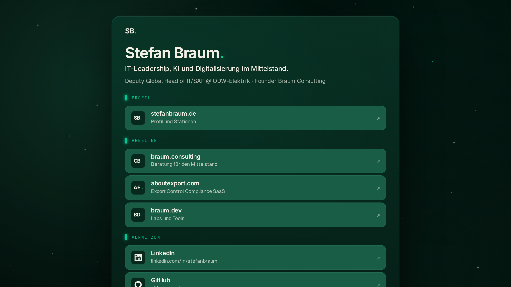

# braum.me

Digital business card as a **routing card**. Identity block + three link groups (Working · Reading · Connecting). One viewport, no scroll on desktop. Mail reveal behind a lightweight name gate (personal / consulting kept separate).

**Live:** [braum.me](https://braum.me)



## Stack

- Astro 5 · SSR via Node adapter
- TypeScript strict · Tailwind 4 · Biome
- Self-hosted fonts (Geist, Inter, JetBrains Mono) via `@fontsource-variable`
- Umami Analytics (self-hosted, optional via env)
- Docker multi-stage · Node 22 Alpine

## Setup

```bash
pnpm install
cp .env.example .env   # fill in contact emails, routing URLs, optional Umami
pnpm dev                # http://localhost:4321
```

## Scripts

| Command | Purpose |
|---|---|
| `pnpm dev` | Local dev server |
| `pnpm build` | Astro check + production build |
| `pnpm preview` | Preview the production build locally |
| `pnpm check` | TypeScript and Astro diagnostics |
| `pnpm lint` | Biome checks |
| `pnpm format` | Biome format write |
| `pnpm og:build` | Re-render OG images (`public/og/*.png` from `src/lib/og.ts`) |

## Environment

See `.env.example`. Summary:

| Variable | Required | Purpose |
|---|---|---|
| `CONTACT_NAME` | yes | Display name |
| `CONTACT_EMAIL` | yes | Personal email (mail gate, type "personal") |
| `CONTACT_EMAIL_CONSULTING` | yes | Consulting email (mail gate, type "consulting") |
| `CONTACT_ORG`, `CONTACT_TITLE` | yes | Display data |
| `CONTACT_URL` | yes | "Hub" · target for the `stefanbraum.de` link |
| `CONTACT_URL_CONSULTING` | yes | Target for the consulting link |
| `CONTACT_URL_ABOUTEXPORT` | yes | Target for the SaaS link |
| `CONTACT_URL_BRAUMDEV` | yes | Target for the labs link |
| `CONTACT_URL_LINKEDIN` | yes | Target for the LinkedIn link |
| `CONTACT_URL_GITHUB` | yes | Target for the GitHub link |
| `CAPTCHA_SECRET` | yes | HMAC key for the math captcha. Generate with `openssl rand -hex 32`. App refuses to boot without it. |
| `UMAMI_SCRIPT_URL`, `UMAMI_WEBSITE_ID` | no | Analytics enabled when both are set |
| `HOST`, `PORT` | no | Defaults `0.0.0.0` / `4321` |
| `RATE_LIMIT_MAX`, `RATE_LIMIT_WINDOW_MS` | no | Contact-API limit (default 5 / 15min) |

**Never commit `.env`.**

## API routes

| Route | Purpose |
|---|---|
| `POST /api/contact` | Body `{ name, type?: "personal" \| "consulting" }`, returns the email from env. Rate-limited. |
| `GET /api/health` | Healthcheck for Coolify |

## URL parameters

For targeted shares and audience-specific landings:

| Param | Effect |
|---|---|
| `?focus=consulting` | Highlights the `braum.consulting` link (pulse ring) |
| `?focus=aboutexport` | Highlights the `aboutexport.com` link |
| `?focus=hiring` / `?focus=cv` / `?focus=writing` | Highlights `stefanbraum.de` |

## Umami events (when enabled)

- `Link · {label}` on every click on a destination (LinkedIn, GitHub, stefanbraum.de, braum.consulting, aboutexport.com, braum.dev)
- `Link · E-Mail` when the mail panel is opened
- `Kontakt · {name}` / `Consulting · {name}` on a successful mail reveal (property `{ name, type }`)

## Deploy · Coolify

1. **Add the repo to Coolify** · Source: any Git remote · Branch `main`
2. **Build pack:** Dockerfile (auto-detected)
3. **Port:** `4321`
4. **Environment variables** in the Coolify UI (placeholders — set the real values in the Coolify UI):
   ```
   CONTACT_NAME=Your Name
   CONTACT_EMAIL=you@example.com
   CONTACT_EMAIL_CONSULTING=you@consulting.example
   CONTACT_ORG=Your Org
   CONTACT_TITLE=Your Title
   CONTACT_URL=https://your-hub.example
   CONTACT_URL_CONSULTING=https://your-consulting.example
   CONTACT_URL_ABOUTEXPORT=https://your-saas.example
   CONTACT_URL_BRAUMDEV=https://your-labs.example
   CONTACT_URL_LINKEDIN=https://www.linkedin.com/in/your-handle
   CONTACT_URL_GITHUB=https://github.com/your-handle
   UMAMI_SCRIPT_URL=https://umami.example.com/script.js
   UMAMI_WEBSITE_ID=00000000-0000-0000-0000-000000000000
   ```
5. **Domain** `braum.me` with a Let's Encrypt certificate
6. **Healthcheck path:** `/api/health`
7. **Deploy** · Git webhook triggers auto-redeploy on push to `main`

## Local Docker test

```bash
docker build -t braum-me .
docker run --rm -p 4321:4321 --env-file .env braum-me
```

## Structure

```
src/
├── components/
│   ├── LinkCard.astro           # Single routing-link card (icon + title + sub + reveal)
│   ├── MailGate.astro           # Name gate + captcha → reveals email
│   └── RoutingCard.astro        # Identity + 3 link groups + mail trigger
├── layouts/BaseLayout.astro     # Umami script, OG, JSON-LD, ambient layers
├── lib/
│   ├── captcha.ts               # HMAC-signed math captcha (stateless)
│   ├── contact.ts               # Env → typed Contact (emails + routing URLs)
│   ├── env.ts                   # Env helper (process.env + import.meta.env fallback)
│   ├── og.ts                    # OG-card SVG renderer + card definitions
│   └── rate-limit.ts            # In-memory rate limiter
├── pages/
│   ├── index.astro              # Homepage
│   ├── mail.astro               # /mail standalone contact page
│   └── api/
│       ├── captcha.ts           # GET issues challenge
│       ├── contact.ts           # Name gate → mail
│       └── health.ts            # Coolify healthcheck
└── styles/global.css            # Tokens, ambient, routing card, mobile

scripts/
└── build-og.ts                  # Renders src/lib/og.ts cards → public/og/*.png

assets/fonts-og/                 # TTFs for OG rendering (Inter, Geist, JetBrains Mono)

public/
├── logo-sb.png                  # Personal brand (favicon, hub link)
├── logo-cb.png                  # Consulting brand (consulting link)
├── s-clean.png                  # Portrait (Schema.org image)
├── og/
│   ├── default.png              # 1200×630 share preview, homepage
│   └── mail.png                 # 1200×630 share preview, /mail
├── robots.txt
└── sitemap.xml
```

## License

MIT — see [LICENSE](./LICENSE).
